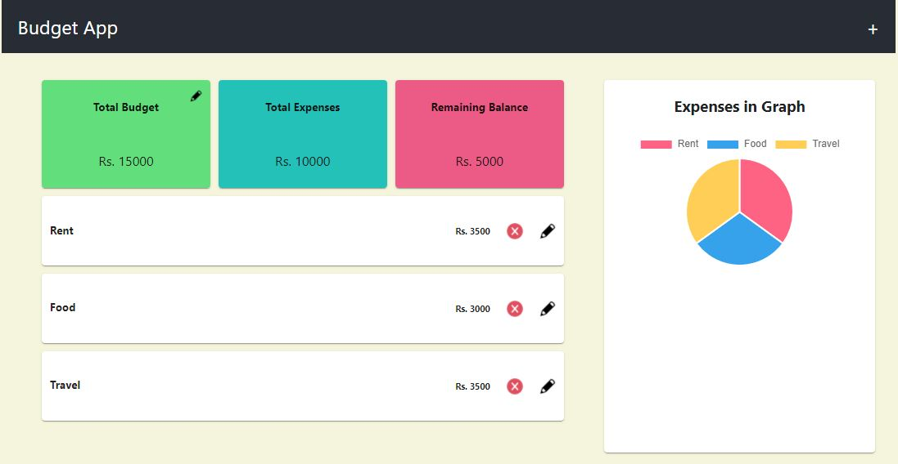

##Budget App with React

This is a simple budget app built in React with crud functionalities. The data is saved in local storage. An user can add, update and delete the records from the UI as well as LocalStorage.

